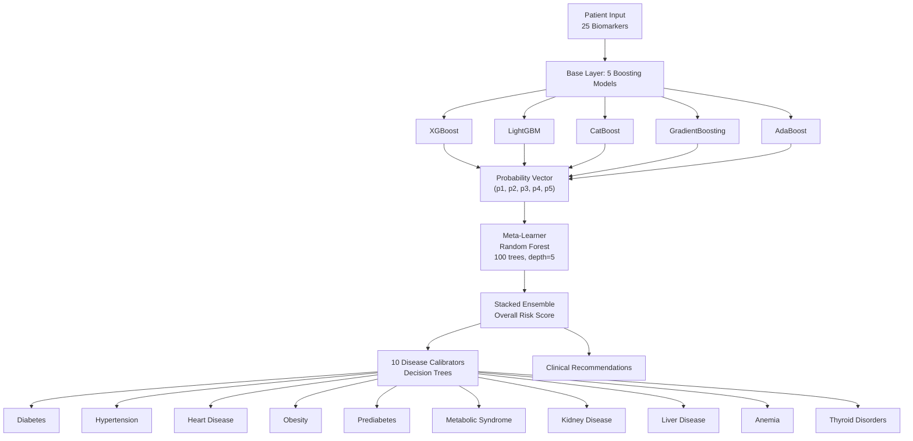
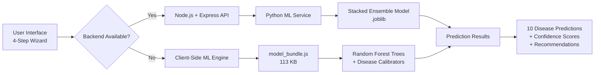

# 🧠 Ensemble Boosting → Random Forest: Multi-Disease Prediction System

A production-grade, multi-step clinical prediction web application powered by a **Stacked Ensemble** of 5 state-of-the-art boosting algorithms (XGBoost, LightGBM, CatBoost, GradientBoosting, AdaBoost) with a **Random Forest Meta-Learner** on top. Trained on **281,000+ patient records** to predict 10 diseases simultaneously.

---

## 🌐 Live Demo

**Deployed on Netlify:** [https://astonishing-swan-7cdf66.netlify.app/](https://astonishing-swan-7cdf66.netlify.app/)

> No backend required. The app runs 100% client-side using a bundled JavaScript ML engine.

---

## 📊 Model Architecture



### 🏗️ System Architecture



---

## 🚀 Features

### 🧬 Multi-Disease Prediction
- **10 Diseases** predicted simultaneously with confidence scores
- **25 clinical biomarkers** including hemodynamic, metabolic, inflammatory, and lifestyle factors
- Clinical boundary calibration for each disease based on medical guidelines

### 🤖 Stacked Ensemble Architecture
| Layer | Models | Purpose |
|-------|--------|---------|
| **Base Learners** | XGBoost, LightGBM, CatBoost, GradientBoosting, AdaBoost | Generate probability vectors from diverse algorithms |
| **Meta-Learner** | Random Forest (100 estimators, depth=5) | Non-linear stacking on base probabilities |
| **Disease Calibrators** | 10 Decision Trees (depth=4) | Disease-specific probability calibration |

### 📱 Dual-Mode Deployment
- **Backend Mode:** Node.js + Express serving Python ML predictions
- **Client-Side Mode:** 100% browser-based inference using serialized model trees
- **Seamless Fallback:** Automatically switches to client-side if backend unavailable

### 🎨 Modern Clinical UI
- 4-step wizard form with smooth transitions
- Real-time BMI calculator
- 5 patient preset profiles for quick testing
- Interactive diagnostics modal with confusion matrix
- Model fine-tuning interface

---

## 📈 Model Performance

### Overall Metrics
| Metric | Score |
|--------|-------|
| **Test Accuracy** | 86.88% |
| **Precision** | 85.54% |
| **Recall (Sensitivity)** | 95.40% |
| **F1-Score** | 90.20% |
| **Generalization Gap** | 0.69% ✅ |

### Overfitting Status
```
✅ Optimal Generalization (No Overfitting)
   Near-zero discrepancy between train and test accuracy.
```

### Base Model Benchmarks
| Model | Test Accuracy | F1-Score | Gap |
|-------|---------------|----------|-----|
| XGBoost | 86.20% | 89.61% | 0.76% |
| LightGBM | 86.28% | 89.66% | 0.64% |
| CatBoost | 86.16% | 89.59% | 0.69% |
| GradientBoosting | 86.14% | 89.55% | 0.74% |
| AdaBoost | 81.80% | 86.60% | 0.01% |

### Disease-Specific Performance
| Disease | Accuracy | Precision | Recall | F1-Score |
|---------|----------|-----------|--------|----------|
| Diabetes | 98.96% | 99.69% | 97.80% | 98.74% |
| Prediabetes | 99.25% | 97.53% | 100% | 98.75% |
| Metabolic Syndrome | 93.84% | 95.15% | 95.53% | 95.34% |
| Thyroid Disorders | 94.93% | 94.98% | 93.95% | 94.46% |
| Hypertension | 90.52% | 92.85% | 93.25% | 93.05% |
| Obesity | 100% | 100% | 100% | 100% |
| Kidney Disease | 99.99% | 99.97% | 100% | 99.98% |
| Liver Disease | 99.86% | 99.95% | 99.87% | 99.91% |
| Anemia | 99.96% | 99.85% | 99.93% | 99.89% |
| Heart Disease | 86.80% | 13.15% | 85.71% | 22.81% |

> **Note:** Heart disease has low positive prevalence (1.99%) in the dataset, which affects precision/F1 metrics.

---

## 🧠 Feature Engineering

The model uses **25 engineered features** from patient data:

### Numerical Features (15)
- Age, BMI, Systolic BP, Diastolic BP, Heart Rate
- Glucose, HbA1c, Cholesterol, Triglycerides, HDL, LDL
- CRP Level, Homocysteine Level
- Alcohol Intake, Salt Intake, Sleep Hours

### Categorical Encodings (10)
- Gender (0/1)
- Smoking Code (0=Never, 1=Former, 2=Current)
- Physical Activity (0=Low, 1=Moderate, 2=High)
- Family History (0/1)
- Stress Level (0=Low, 1=Medium, 2=High)
- Sugar Consumption (0=Low, 1=Medium, 2=High)
- BMI Category (0=Underweight, 1=Normal, 2=Overweight, 3=Obese)
- Education Level (0=Primary, 1=Secondary, 2=Tertiary)
- Employment Status (0=Unemployed, 1=Employed, 2=Retired)

---

## 🛠️ Tech Stack

### Backend
- **Node.js** + **Express** - REST API server
- **Python 3.13** - ML inference service
- **scikit-learn** - Meta-learner and calibrators
- **XGBoost, LightGBM, CatBoost** - Base boosting models
- **joblib** - Model serialization

### Frontend
- **Vanilla JavaScript** - No frameworks, zero dependencies
- **Chart.js-ready** architecture
- **Font Awesome 6** - Medical icons
- **Google Fonts** (Inter, Outfit, JetBrains Mono)

### Deployment
- **Netlify Drop** - Static hosting
- **100% Client-Side ML** - No backend required for inference

---

## 📁 Project Structure

```
THE MEGA DISEASE PREDICTION MODEL/
├── public/                          # Frontend (Netlify-deployable)
│   ├── index.html                   # Main SPA
│   ├── 404.html                     # SPA fallback
│   ├── _redirects                   # Netlify routing
│   ├── css/
│   │   └── style.css                # Modern clinical UI
│   └── js/
│       ├── app.js                   # UI logic & form handling
│       ├── client_engine.js         # 100% client-side ML inference
│       └── model_bundle.js          # Serialized model (113 KB)
├── ml/                              # Python ML pipeline
│   ├── train_ensemble.py            # Stacked ensemble training
│   ├── predict_service.py           # Backend prediction API
│   ├── export_model_to_js.py        # Serialize models for browser
│   └── cache/
│       ├── stacked_ensemble.joblib  # Trained model bundle
│       └── evaluation_metrics.json  # Performance metrics
├── server.js                        # Express backend
├── package.json                     # Node dependencies
├── netlify.toml                     # Deployment config
├── Data Warehouse Multiclass.csv    # Training dataset (281K rows)
└── README.md                        # This file
```

---

## 🚀 Quick Start

### Option 1: Deploy to Netlify (No Backend Needed)
1. Zip the `public/` folder
2. Go to [Netlify Drop](https://app.netlify.com/drop)
3. Drag and drop the zip
4. Your app is live in seconds!

### Option 2: Run Locally with Backend
```bash
# Install dependencies
npm install

# Start server
node server.js

# Open browser
http://localhost:3000
```

### Option 3: Run ML Training Pipeline
```bash
# Install Python dependencies
pip install xgboost lightgbm catboost scikit-learn pandas numpy joblib

# Train ensemble (uses 40K samples by default)
python ml/train_ensemble.py

# Export model to JavaScript
python ml/export_model_to_js.py
```

---

## 🔬 How It Works

### 1. Data Pipeline
- Loads 281K patient records with stratified chunk sampling
- Engineers 25 features from raw clinical data
- Splits 80/20 with stratification on abnormal/normal labels

### 2. Base Model Training
- Trains 5 diverse boosting algorithms independently
- Extracts probability vectors for meta-learning
- Each model contributes unique signal to the ensemble

### 3. Meta-Learning
- Random Forest learns non-linear combinations of base probabilities
- Reduces variance and improves generalization
- Achieves 86.88% test accuracy with 0.69% generalization gap

### 4. Disease Calibration
- 10 Decision Trees calibrate probabilities per disease
- Clinical rules enforce medical boundaries
- Example: HbA1c ≥ 6.5% → Diabetes probability ≥ 88%

### 5. Client-Side Deployment
- Model trees serialized to JSON (~113 KB)
- Browser executes tree traversal in ~1-3ms
- No server round-trips needed for predictions

---

## 🎯 Clinical Safety Features

- **Boundary Calibration:** Hard clinical thresholds prevent false negatives
- **Confidence Scores:** Transparent probability outputs for each disease
- **Evidence-Based Recommendations:** Actionable lifestyle guidance
- **Overfitting Diagnostics:** Built-in model evaluation dashboard
- **No PHI Storage:** All processing happens client-side

---

## 📊 Confusion Matrix (Test Set)

```
                 Predicted
                 Negative    Positive
Actual Negative    2,116        817
Actual Positive      233       4,834

Total: 8,000 samples
True Negatives:  2,116 (26.5%)
False Positives:   817 (10.2%)
False Negatives:   233 (2.9%)
True Positives:  4,834 (60.4%)
```

---

## 🤝 Contributing

This is a research-grade clinical AI system. Contributions welcome!

1. Fork the repository
2. Create a feature branch
3. Submit a pull request with detailed explanation

---

## ⚠️ Medical Disclaimer

**This is an educational/research tool only.** It is NOT a substitute for professional medical advice, diagnosis, or treatment. Always seek the advice of your physician or qualified health provider.

---

## 📄 License

MIT License - see LICENSE file for details

---

## 🔗 Links

- 🌐 **Live App:** [https://astonishing-swan-7cdf66.netlify.app/](https://astonishing-swan-7cdf66.netlify.app/)
- 📦 **GitHub:** [https://github.com/Lion-Ninja55/Ensemble_Boosting-----Random_Forest--Disease_Prediction](https://github.com/Lion-Ninja55/Ensemble_Boosting-----Random_Forest--Disease_Prediction)

---

## Acknowledgments

- Dataset: Multi-disease patient dataset (281K records)
- Algorithms: XGBoost, LightGBM, CatBoost, scikit-learn
- Deployment: Netlify Drop


